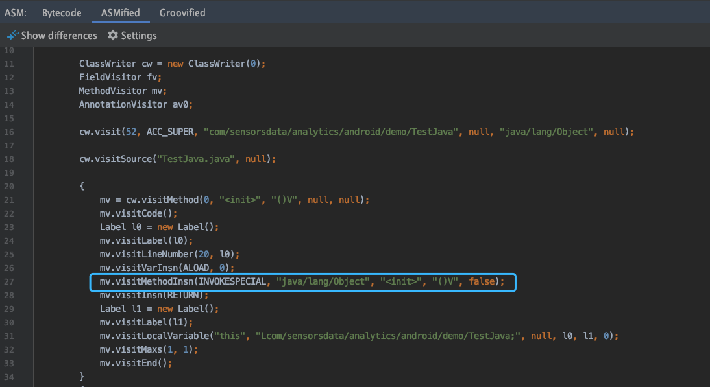

### ASM 字节码增强技术—给所有方法添加日志和异常捕捉

在 [AOP 利器 ASM 基础入门](https://juejin.cn/post/6877925000045658119) 博文中，介绍了 `ASM` 的基础知识和整体 `API` 结构，让我们对 `ASM` 有一个初步的认识。本篇博文将介绍三个案例来加深对 `ASM` 接口的理解。

1. 删除日志：删除项目中的所有 `Log` 输出

2. 添加日志：给项目添加 `Log` 日志输出

3. 添加 `try...catch` 异常捕捉：给项目的所有方法添加异常步骤

文中的案例皆是以 `Android` 项目为基础，所以先介绍一些基本概念。

#### 1. 基本概念

##### 1.1 Transform API

`Android Gradle` 在 `1.5.0` 版本后提供了 `Transfrom API` 接口，允许第三方 `Plugin` 在打包 `dex` 之前的编译过程中操作 `.class` 文件。通俗点说 `Android` 提供了在编译时修改字节码的入口。

一个 `Transform` 就是一个新的 `Task`，它是通过链式进行执行，即上一个 `Transform` 的输出作为当前 `Transform` 的输入，它的输出又作为下一个 `Transform` 的输入。`Transform` 的输入是用 `TransformInput` 表示，包含 `JarInput` 和 `DirectoryInput`，输出使用 `TransformOutputProvider` 表示。


##### 1.2 自定义插件

在 `Android` 中提供了很多插件，比如 `apply plugin: 'com.android.application'` ：表示一个 `App` 应用的插件；`apply plugin: 'com.android.library'`：表示一个类库的插件。同样我们可以继承 `Plugin` 实现一个自定义插件。在实际的业务中通常会采用 `Plugin` + `Transform` + `ASM` 的方式来实现一个功能强大的自定义插件。关于自定义插件的实现，有很多博文都有介绍，这里就不展开了。

> 涉及的案例源码下载地址：https://github.com/dengshiwei/asm-example

#### 2. 删除日志

在 `Android` 开发中，我们常会使用 `Log` 类进行日志的输出，但是一些安全检测会认为输出日志是一种风险行为，所以要求被检测的 `App` 删除所有的日志打印。那么我们就可以通过 `ASM` 的技术，在编译时期实现进行 `Log` 日志的删除。

##### 目标

删除项目中所有的 `Log` 日志类输出的日志。

##### 思路

既然要删除项目中所有的 `Log` 日志输出，那么我们就需要检测 `Log` 日志输出在哪里被调用。通过 [AOP 利器 ASM 基础入门](https://juejin.cn/post/6877925000045658119) 博文可以了解到，`MethodVisitor` 类用于方法的访问，其中 `visitMethodInsn` 接口是对方法实现的每个指令的回调。我们只需要在这个回调里判断是 `Log` 类的 `d`、`e` 或 `i` 等的日志输出方法时，然后直接返回即可。

##### 关键代码实现

```kotlin
/**
 * 在方法内部调用的地方，检测 Log 的用法，然后进行删除
 */
override fun visitMethodInsn(opcodeAndSource: Int, owner: String?, name: String?, descriptor: String?, isInterface: Boolean) {
    if (Opcodes.ACC_STATIC.and(opcodeAndSource) != 0 && owner == "android/util/Log" && (name == "d" || name == "i" || name == "e" || name == "w" || name == "v")
            && descriptor == "(Ljava/lang/String;Ljava/lang/String;)I"
    ) {
        /**
         * 直接 return 只是删除了 Log 指令的调用，但是对应的当前的操作数栈没有进行处理
         */
        return
    }

    super.visitMethodInsn(opcodeAndSource, owner, name, descriptor, isInterface)
}
```

上面的代码中，在 `visitMethodInsn` 方法中判断 `owner` 类名是不是 `Log`、方法名 `name` 是 `d`、`i`、`e`、`w` 或 `v`，并且方法修饰符是 `static` 类型，如果满足上面的条件，则说明该处方法调用是 `Log` 日志输出，则直接 `return`。

#### 3. 添加日志

一个接口被多个地方调用，排查问题时就很需要打印出方法的调用顺序，开发的时候没打印这些信息，手动添加有可能有遗漏，所以自定义插件添加最方便。

##### 目标

在方法进入的时候，添加日志打印当前方法的名称。

##### 思路

同样，打印所有方法的调用名称，我们需要在方法进入的时候调用 `Log` 类进行日志的输出。通过 [AOP 利器 ASM 基础入门](https://juejin.cn/post/6877925000045658119) 博文可以了解到，`ASM` 中提供的 `AdviceAdapter` 类可以检测方法的访问时机。

- `onMethodEnter`：方法访问开始时
- `onMethodExit`：方法访问结束时

我们只需要在 `onMethodEnter` 方法中调用 `Log` 进行日志输出即可。

##### 关键代码实现

```kotlin
/**
 * 增加所有调用方法的名称日志输出的地方
 */
internal class PrintLogInterceptor(var className: String?, methodVisitor: MethodVisitor,
                                   access: Int,
                                   name: String?,
                                   descriptor: String?) : AdviceAdapter(PluginConstant.ASM_VERSION, methodVisitor, access, name, descriptor) {

    override fun onMethodEnter() {
        super.onMethodEnter()
        // 将当前类名添加到操作栈，作为 TAG
        mv.visitLdcInsn(StringUtils.getFileName(className!!))
        // 将当前方法名添加到操作栈，进行输出
        mv.visitLdcInsn(name)
        mv.visitMethodInsn(Opcodes.INVOKESTATIC, "android/util/Log", "d", "(Ljava/lang/String;Ljava/lang/String;)I", false)
    }
}
```

首先调用 `visitLdcInsn` 将类名和方法名推入到操作数栈，然后通过 `visitMethodInsn` 方法调用 `Log.d(String tag, String msg)` 进行日志的输出。

##### 示例

原始的代码片段：

```kotlin
public class MainActivity extends AppCompatActivity {
    public void testLog() {
        Log.d("TAG","dsw");
        Log.i("TAG","dsw");
        Log.v("TAG","dsw");
        Log.w("TAG","dsw");
        Log.e("TAG","dsw");
    }
}
```

查看处理后的 `.class` 文件中的代码片段：

```kotlin
public class MainActivity extends AppCompatActivity {
    public String testString(String var1, String var2) {
        Log.d("MainActivity", "testString");
        int var3 = 5 / 0;
        return "HelloWorld";
    }
}
```

可以看到已经在方法刚进入时插入了日志输出。

#### 4. 添加 try...catch 异常捕捉

##### 目标

给项目中所有方法添加 `try...catch` 块，并调用 `Exception.printStackTrace` 输出日志。

##### 思路

将所有的方法添加 `try...catch` 块，意味着方法的整个实现是在 `try` 块中，然后我们插入 `catch` 块的实现即可。在 `MethodVisitor` 类中提供了 `visitTryCatchBlock(final Label start, final Label end, final Label handler, final String type)` 用于生成一个 `try...catch` 块，其中 `start` 表示其实位置，`end` 表示结束位置，`handler` 表示 `Exception` 开始的位置，`tpye` 表示异常参数的类型。所以我们在方法访问开始前，先调用 `visitLabel` 定义起始位置，然后在方法结束前调用 `visitLable` 定义结束位置。有个细节需要注意，`catch` 块中需要根据方法的返回值类型添加异常时的返回值。

##### 关键代码实现

```kotlin
class TryCatchInterceptor(methodVisitor: MethodVisitor, access: Int, name: String?, var descriptor: String?) :
        AdviceAdapter(PluginConstant.ASM_VERSION, methodVisitor, access, name, descriptor) {
    private val labelStart = Label()
    private val labelEnd = Label()
    private val labelTarget = Label()
    override fun onMethodEnter() {
        // 定义开始位置
        mv.visitLabel(labelStart)
        // 开始 try...catch 块
        mv.visitTryCatchBlock(labelStart, labelEnd, labelTarget, "java/lang/Exception")
    }

    override fun visitMaxs(maxStack: Int, maxLocals: Int) {
        // 定义正常代码结束的位置
        mv.visitLabel(labelEnd)
        // 定义 catch 块开始的位置
        mv.visitLabel(labelTarget)
        val local1 = newLocal(Type.getType("Ljava/lang/Exception"))
        mv.visitVarInsn(Opcodes.ASTORE, local1)
        mv.visitVarInsn(Opcodes.ALOAD, local1)
        // 输出 ex.printStackTrace
        mv.visitMethodInsn(Opcodes.INVOKEVIRTUAL, "java/lang/Exception", "printStackTrace", "()V", false)
        //判断方法的返回类型
        mv.visitInsn(getReturnCode(descriptor = descriptor))
        super.visitMaxs(maxStack, maxLocals)
    }

    /**
     * 获取对应的返回值
     */
    private fun getReturnCode(descriptor: String?): Int {
        return when (descriptor!!.subSequence(descriptor.indexOf(")") + 1, descriptor.length)) {
            "V" -> Opcodes.RETURN
            "I", "Z", "B", "C", "S" -> {
                mv.visitInsn(Opcodes.ICONST_0)
                Opcodes.IRETURN
            }
            "D" -> {
                mv.visitInsn(Opcodes.DCONST_0)
                Opcodes.DRETURN
            }
            "J" -> {
                mv.visitInsn(Opcodes.LCONST_0)
                Opcodes.LRETURN
            }
            "F" -> {
                mv.visitInsn(Opcodes.FCONST_0)
                Opcodes.FRETURN
            }
            else -> {
                mv.visitInsn(Opcodes.ACONST_NULL)
                Opcodes.ARETURN
            }
        }
    }
}
```

##### 案例

原始代码片段：

```kotlin
public class MainActivity extends AppCompatActivity {
    public void testLog() {
        Log.d("TAG","dsw");
        Log.i("TAG","dsw");
        Log.v("TAG","dsw");
        Log.w("TAG","dsw");
        Log.e("TAG","dsw");
    }
}
```

查看处理后的 `.class` 文件中的代码片段：

```kotlin
public class MainActivity extends AppCompatActivity {
    public String testString(String var1, String var2) {
        try {
            int var3 = 5 / 0;
            return "HelloWorld";
        } catch (Exception var5) {
            var5.printStackTrace();
            return null;
        }
    }
}
```

添加 `try...catch` 块复杂一些，那有的同学该疑惑了？字节码我不了解该怎么写呢？这里给大家安利一个工具 [ASM Bytecode Outline](https://plugins.jetbrains.com/plugin/5918-asm-bytecode-outline)，可以直接安装在 `IDE` 中，然后右键 **Show Bytecode outline** 在对应的文件上，弹出的面板展示三项内容：

- `Bytecode` ：表示对应的 `.class` 字节码文件
- `ASMified` ：表示使用 `ASM` 框架生成字节码时对应的代码
- `Groovified` ：对应的是 `.class` 字节码指令



#### 5. 总结

字节码增强技术可以在编译时动态修改字节码，典型的场景比如埋点插桩，同时也可用于一些线上问题定位于修复以及在开发中减少冗余代码，大大提高开发效率。